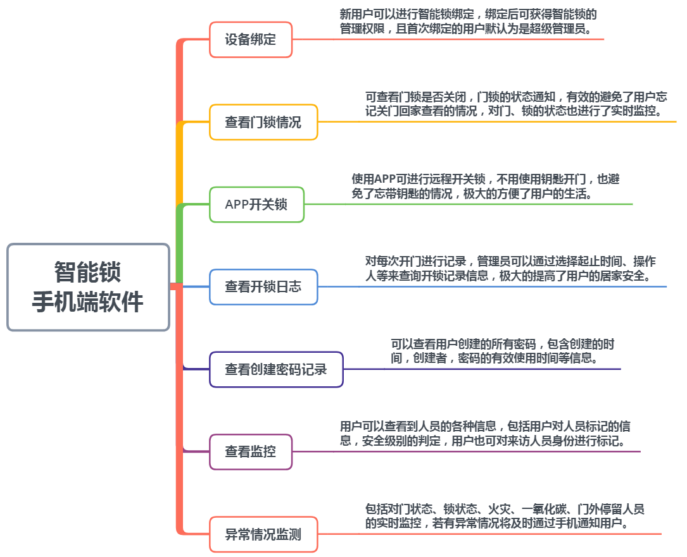
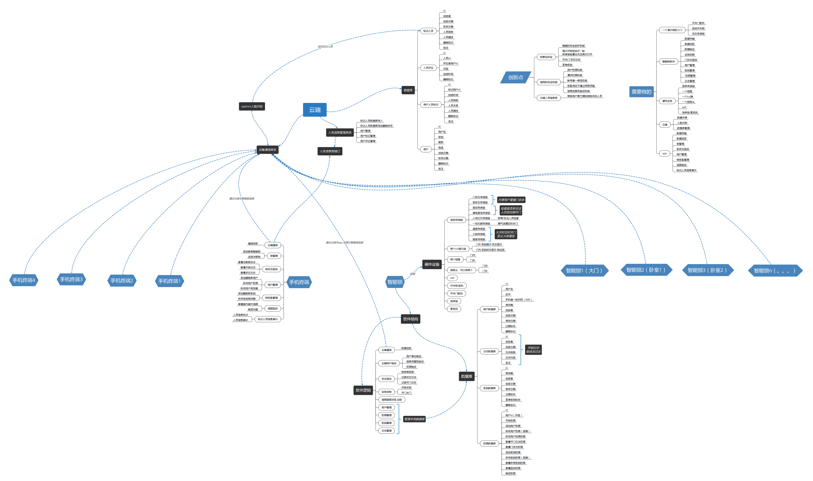
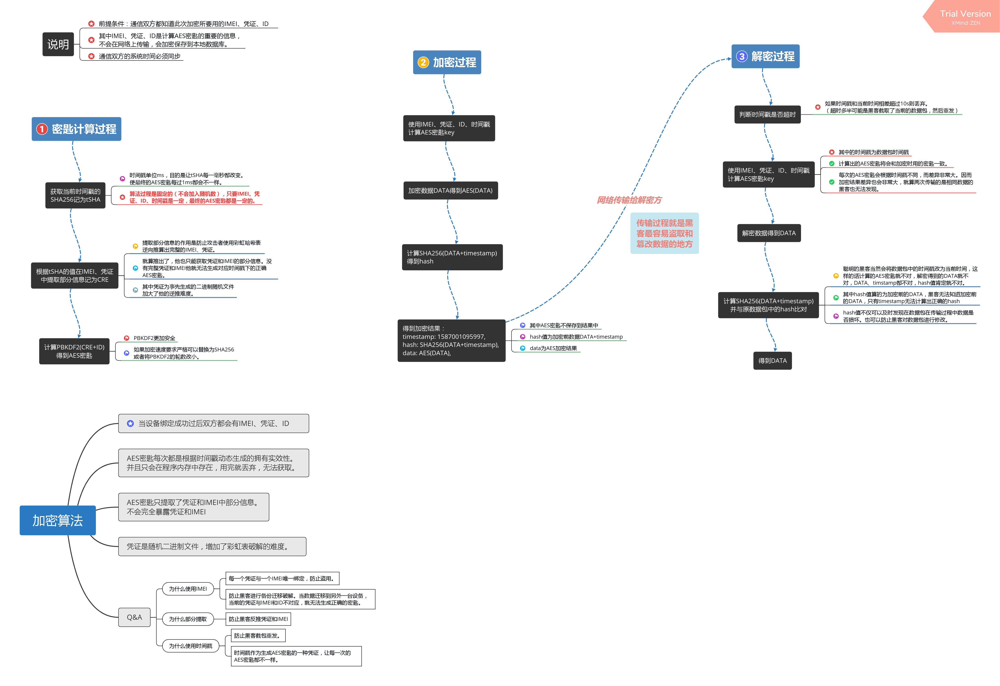
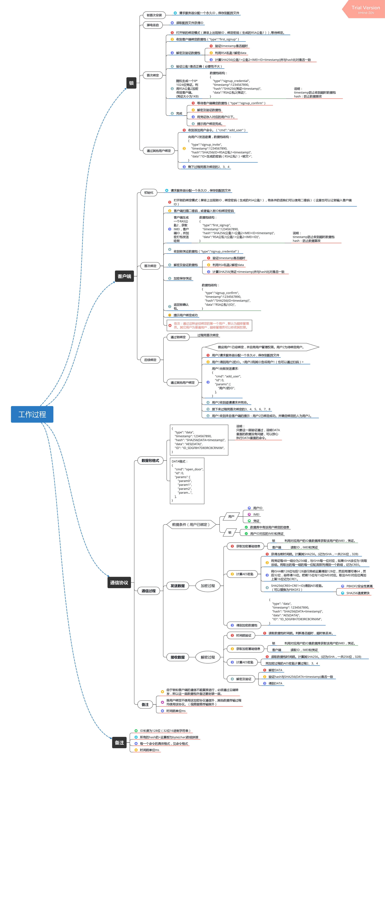
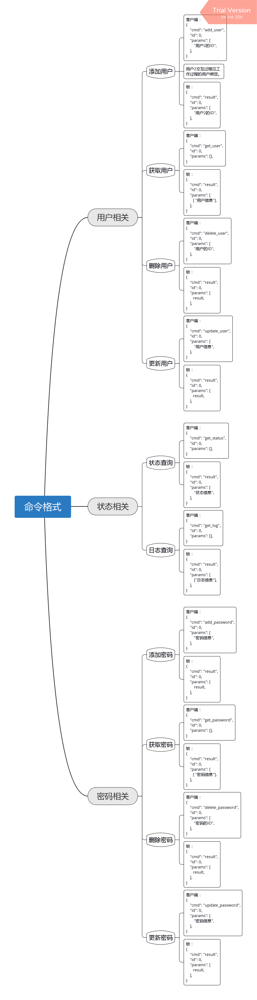
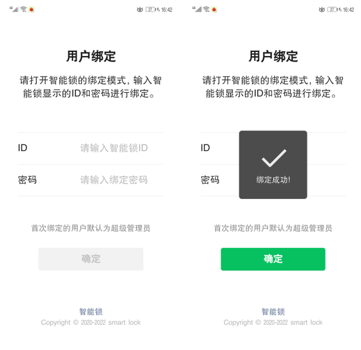
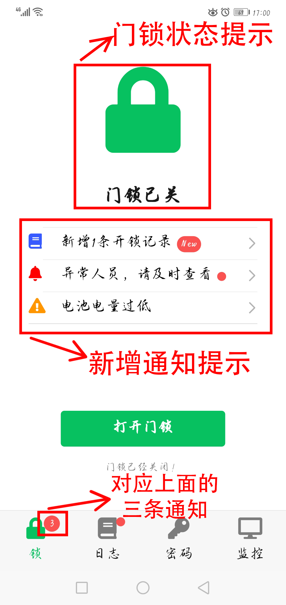
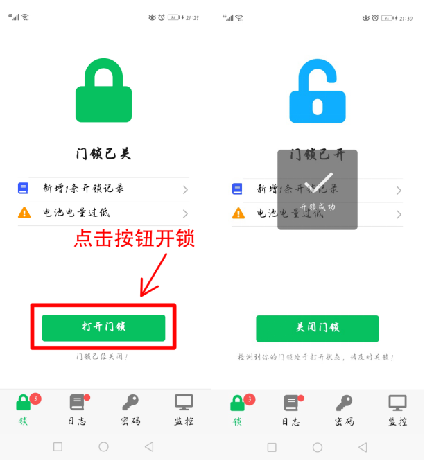
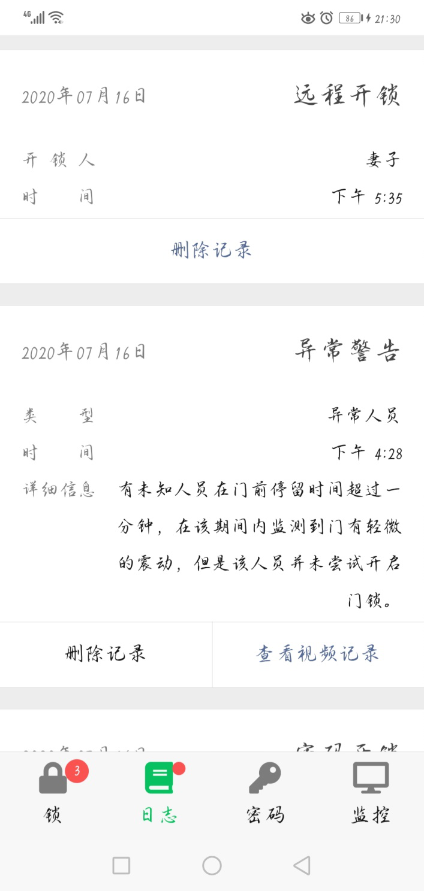
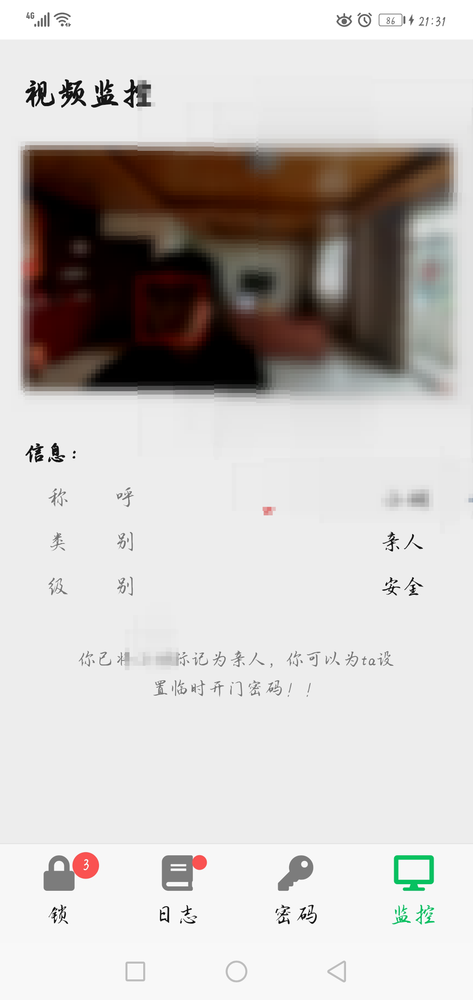

[![MIT License][license-shield]][license-url]


<br />
<p align="center">
  <a href="https://github.com/DaviesGit">
    
  </a>

  <h3 align="center">Maked by Davies</h3>

  <p align="center">
    Email: 1182176003@qq.com
<!--     <br />
    <a href="https://github.com/DaviesGit"><strong>Explore the docs »</strong></a>
    <br />
    <br />
    <a href="javascript:void(0)">View Demo</a>
    ·
    <a href="javascript:void(0)">Report Bug</a>
    ·
    <a href="javascript:void(0)">Request Feature</a> -->
  </p>
</p>


<!-- TABLE OF CONTENTS -->
## Table of Contents

* [About the Project](#about-the-project)
  * [Built With](#built-with)
* [Getting Started](#getting-started)
  * [Prerequisites](#prerequisites)
  * [Installation](#installation)
* [Usage](#usage)
* [功能定制](#功能定制)
* [Roadmap](#roadmap)
* [Contributing](#contributing)
* [License](#license)
* [Contact](#contact)
* [Acknowledgements](#acknowledgements)
* [免责声明](#免责声明)


<!-- ABOUT THE PROJECT -->
## About The Project

该智能门锁系统不仅具有远程开锁，远程开关门，设置临时密码，紧急密码等普通功能，还具有生成每日开锁日志，状态异常监控警报，远程喊话，人员安全标记，信息加密传输等更能保障安全的功能。该系统由智能锁设备和手机终端组成。智能锁设备的构造主要包括门锁控制芯片、矩阵键盘、监控、语音、传感器等模块。智能锁设备以单片机为主控制器,通过云端实现智能锁设备与手机的互动。云端的人员信息管理系统中存储着大量人员信息，智能锁设备通过检测门口未知人员的视频进行分析，判断该人员的身份状态和安全指数并将判断结果发送到手机。

#### 系统功能



#### 系统架构




#### 加密过程



#### 系统工作过程



#### 数据封装格式



#### 绑定界面



#### 首页



#### 开关锁



#### 日志查看



#### 密码管理


#### 视频监控（支持人员识别）



#### 功能:

* 远程开锁。
* 远程开关门。
* 开锁日志。
* 家庭安全监控。
* 安全联动关门。
* 状态异常监控警报。
* 远程喊话。
* 人员安全标记。
* 用户权限。
* 临时密码。
* 紧急密码。

#### 构成：

> 硬件：
> 	两个舵机控制
> 	键盘显示屏
> 	wifi/网线
> 	图像采集
> 	传感器
> 	扬声器
>
> 锁：
> 	视频上传
> 	日志存储
> 	云端通信
> 	加密
> 	用户数据库
> 	密码数据库
> 	权限数据库
>
> 云端：
> 	人脸识别
> 	人员信息
> 	信息转发
>
> 手机：
> 	远程开锁
> 	视频监控
> 	状态日志
> 	异常通知
> 	用户管理
> 	密码管理

#### 加密系统

> 为了保证加密的数据不被破解，锁控制系统，云端，手机端之间通行需要一种加密机制，我们使用了一套更加安全的验证机制。
> 首先是登录机制，当用户第一次使用这个系统时，用户需要登录，系统会告诉用户登录的锁的id和密码，用户用这个id、密码和用户的手机唯一标识（IMEI）登录锁过后，锁就会给用户分配一个永久的id，并且给用户一个永久的登录凭证，凭证通过RAS算法加密传输，防止被中途窃取，当用户登录成功过后，登录密码就作废，以后每次发起请求时只需要这个凭证和手机标识符就行了。
> 当用户需要对锁发出请求的时候，他需要用当前的时间戳，手机唯一标识符，登录凭证通过pbkdf2算法获得一个hash值作为AES数据加密密码，然后再加上数据的hash值加上加密密码算出另外一个hash值作为校验码。当锁收到这个请求时，它首先会验证时间戳是否超时，超时就丢掉，防止恶意重发。然后查找数据库找到当前用户id的手机唯一标识符，和登录凭证，算出AES加密密码，解密数据，然后再算出校验码，比对是否一致，如果一致则进行相应的操作，如果不一致则数据包可能损坏或者被恶意篡改，则将当前请求丢弃。
> 通过以上的验证机制可以保证数据的完整性，同时可以加大系统破解的难度。


#### 详细功能介绍

1. 来访人员安全信息监控
	云端是存储有在逃，犯罪，有不良记录等人员的信息。通过安装在门上的摄像头采集来访人员信息，并对其进行人脸识别，当有人员来访（按响门铃，不明人员长时间在门前徘徊，有人尝试开锁），我们在云端数据库获取到这个人的基本信息（人员属性：外卖员/在逃人员/危险人员/不良记录人员；来访记录；其他用户的安全标记与评价信息）使其显示到手机，并且在手机能够实时显示摄像头视频（可以选择开启声音），用户如果知道这个人是不良人员或者外卖员，可以对其标记，标记会传到云端，当这个人在其他人门口被监控到时就会显示他的标记信息，让户主知道这个人是否可信。
2. 安全保护联动系统
	情形：一般情况下大门都是常闭的，而卧室门一般都是常开的
	智能门锁系统会装有一系列传感器：强电场强磁场干扰检查传感器，门锁状态传感器，摄像头模块状态传感器，电动开关门器，震动检测器，温度传感器，机械开锁传感器，如果你们家所有门都是智能门锁系统时，当你出门在外，如果大门的锁监测到异常情况（多次指纹，密码，机械开锁失败，长时间强烈震动，摄像头模块异常断开，门在未开锁情况下打开等）我们都会第一时间通过云端告知用户，我们通过某种规则判断这种异常情况很可能是小偷，我们会自动通过云端通知房间中的其他门自动关上（使用电动开关门器)，并且加锁级别设置为最高，需要通过多重验证才能重新开启门。这样即使小偷打开了大门，他也无法去重要的地方偷到东西。你也可以设置当你出门关闭大门时，就自动关闭卧室门并加锁，这样，即使小偷翻窗进来，也只能偷到一个房间的东西。如果家里有保姆或者小孩，你也可以设置每一个门的权限，只能让他们在规定的区域活动。大门有超时自动关闭功能，当你忘记关闭大门，大门会在5分钟后自动关闭（这个可以在app上设置），防止不法人员趁房门打开偷偷溜进家里偷东西。
3. 门状态监控系统
	在你的手机app上面可以随时看到你门开关的情况（对出门突然忘记自己关门没有的人士特别有用，如果你忘记关门，可以在app上远程关门），并且可以远程开关门，并且会记录一个门的开关的日志，你可以看到是谁在哪个时段进入了你的房间。并且我们可以通过开关门的日志来判断这个户主的情况（比如家里是只有一个空巢老人，云端系统会监控这个老人的进出习惯，如果这个老人每天都出门，突然有一天或者两天他没有出门，或者突然有一天他晚上出门，很有可能这个老人就遇到问题了，可以及时通知家人）。
4. 更加高级的密码保护系统
	如果系统检测到有人多次尝试密码，指纹或者钥匙开锁，系统会进入保护状态，保护状态会马上通过app通知户主，让户主通过摄像头查明情况，并且会让物理开锁会失效（即使他成功转动了锁芯，门锁也不会打开）密码与指纹也不再进行验证，即使他输入了正确的密码或者使用了正确的指纹，也会提示他密码错误或者指纹错误，这样坏人永远也不能通过尝试的方式打开门锁。户主需要进行多重验证才能解除保护。
	随机密码开锁，用户可以在输入密码时随意输入任意数字，只要用户输入的数字中包含了当前的 日期或时间 并且 包含了当前亮起的数字键盘中的任意3个或3个以上数字 并且 用户设置的密码 门锁才会打开（逻辑关系为：（有日期|有时间）&（有任意3位亮起的数字）&（包含密码） 。） 这样即使坏人看到了你的密码，他也打不开。
	支持临时密码，临时指纹，临时密匙（用在app开锁）。
5. 紧急密码
	如果有坏人挟持你开锁，或者有坏人要求你说出密码，你可以输入或告诉他一个紧急密码，当这个密码输入过后，门会打开，但同时会锁会向云端发出安全警报，云端会第一时间联系警方。
6. 远程呼叫户主，对话，警报功能
	如果有客人来访，但是你又不再家，他可以通过呼叫户主功能在app上联系到你，然后你可以马上生成一个临时密码告诉他，让他进去。
	如果你发现这个来访人员是坏人，正在尝试破坏门锁，你可以打开警报声，并同时喊话，迫使坏人离开。


### Built With
使用的库或技术
* [GCC, the GNU Compiler Collection - GNU Project - Free ...](https://gcc.gnu.org/)
* [Java | Oracle](https://www.java.com/)
* [SQLite Home Page](https://www.sqlite.org/)
* [MySQL](https://www.mysql.com/)
* [Apache Tomcat® - Welcome!](http://tomcat.apache.org/)
* [Spring Boot](https://spring.io/projects/spring-boot)
* etc


<!-- GETTING STARTED -->

## Getting Started

这个章节将指导你简单的部署和使用该软件。

### Prerequisites

这个项目的依赖安装步骤在下面给出。
* 支持运行linux的开发板（作为锁体控制系统）
* 摄像头（根据开发板选择）
* 键盘（根据开发板选择）
* 显示屏（根据开发板选择）
* 云服务器
* android手机


### Installation

1. Clone the repo
```sh
git clone https://github.com/path/to/the/repository
```

2. 云服务器安装jre和tomcat。
3. 编译lock_server

```sh
cd lock_server && mvn install
```

4. 将`target`文件夹中的`lock.war`部署到云服务器的`tomcat`中。
5. 编译`lock_hardware/qt_jiemian/`文件夹中的硬件部分代码。

```
cd path/to/the/src && qmake
```

6. 将编译的目标代码下载到对应的硬件上面。
7. 启动硬件程序。


<!-- USAGE EXAMPLES -->

## Usage

1. 手机浏览器打开https://pathtotheserver/lock/static/index.html
2. 使用方法请参考`手机端使用说明.pdf`


## 功能定制

如果需要功能定制，请联系作者 [1182176003@qq.com](1182176003@qq.com)


<!-- ROADMAP -->
## Roadmap

See the [open issues](https://example.com) for a list of proposed features (and known issues).


<!-- CONTRIBUTING -->
## Contributing

Contributions are what make the open source community such an amazing place to be learn, inspire, and create. Any contributions you make are **greatly appreciated**.

1. Fork the Project
2. Create your Feature Branch (`git checkout -b feature/AmazingFeature`)
3. Commit your Changes (`git commit -m 'Add some AmazingFeature'`)
4. Push to the Branch (`git push origin feature/AmazingFeature`)
5. Open a Pull Request


<!-- LICENSE -->
## License

Distributed under the MIT License. See `LICENSE` for more information.


<!-- CONTACT -->
## Contact

Davies - [@qq](1182176003) - 1182176003

Davies - [@email](1182176003@qq.com) - 1182176003@qq.com


<!-- ACKNOWLEDGEMENTS -->
## Acknowledgements
* [GitHub](https://github.com/)


## 免责声明
* 该软件中所包含的部分内容，包括文字、图片、音频、视频、软件、代码、以及网页版式设计等可能来源于网上搜集。

* 该软件提供的内容仅用于个人学习、研究或欣赏，不可使用于商业和其它意图，一切关于该软件的不正当使用行为均与我们无关，亦不承担任何法律责任。使用该软件应遵守相关法律的规定，通过使用该软件随之而来的风险与我们无关，若使用不当，后果均由个人承担。

* 该软件不提供任何形式的保证。我们不保证内容的正确性与完整性。所有与使用该软件的直接风险均由用户承担。

* 如果您认为该软件中所包含的部分内容侵犯了您的权益，请及时通知我们，我们将尽快予以修正或删除。


<!-- MARKDOWN LINKS & IMAGES -->
<!-- https://www.markdownguide.org/basic-syntax/#reference-style-links -->

[license-shield]: readme_images/MIT_license.svg
[license-url]: https://opensource.org/licenses/MIT

[product-screenshot]: readme_images/screenshot.png
